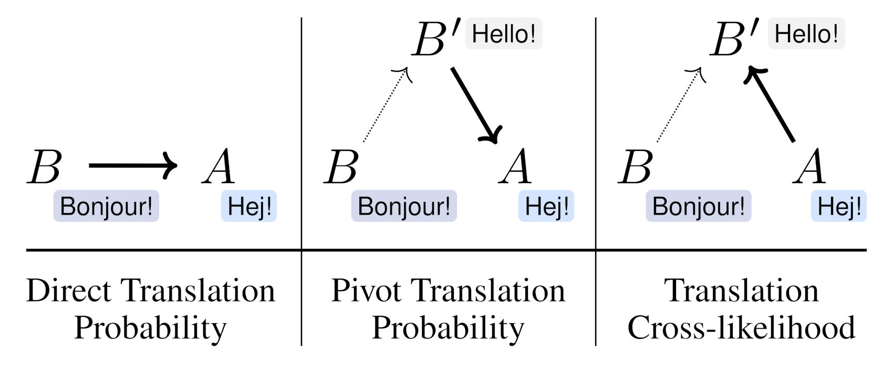

# NMTScore

[](https://pypi.python.org/pypi/nmtscore/)

A library of translation-based text similarity measures.

To learn more about how these measures work, have a look at [Jannis' blog post](https://vamvas.ch/nmtscore-text-similarity-via-translation). Also, read our paper, ["NMTScore: A Multilingual Analysis of Translation-based Text Similarity Measures"](https://aclanthology.org/2022.findings-emnlp.15/) (Findings of EMNLP).



## Installation

- Requires Python >= 3.8 and PyTorch
- `pip install nmtscore`
- Extra requirements for the Prism model: `pip install nmtscore[prism]`

## Usage

### NMTScorer
Instantiate a scorer and start scoring short sentence pairs.

```python
from nmtscore import NMTScorer

scorer = NMTScorer()

scorer.score("This is a sentence.", "This is another sentence.")
# 0.4677300455046415
```

#### Different similarity measures
The library implements three different measures:

```python
# Translation cross-likelihood (default)
scorer.score_cross_likelihood(a, b, tgt_lang="en", normalize=True, both_directions=True)

# Direct translation probability
scorer.score_direct(a, b, a_lang="en", b_lang="en", normalize=True, both_directions=True)

# Pivot translation probability
scorer.score_pivot(a, b, a_lang="en", b_lang="en", pivot_lang="en", normalize=True, both_directions=True)
```

The `score` method is a shortcut for cross-likelihood.

#### Batch processing
The scoring methods also accept lists of strings:

```python
scorer.score(
    ["This is a sentence.", "This is a sentence.", "This is another sentence."],
    ["This is another sentence.", "This sentence is completely unrelated.", "This is another sentence."],
)
# [0.46772973967003206, 0.15306852595255185, 1.0]
```

The sentences in the first list are compared element-wise to the sentences in the second list.

The default batch size is 8.
An alternative batch size can be specified as follows (independently for translating and scoring):

```python
scorer.score_direct(
    a, b, a_lang="en", b_lang="en",
    score_kwargs={"batch_size": 16}
)

scorer.score_cross_likelihood(
    a, b,
    translate_kwargs={"batch_size": 16},
    score_kwargs={"batch_size": 16}
)
```

#### Different NMT models
This library currently supports four NMT models:
- [`small100`](https://huggingface.co/alirezamsh/small100) by [Mohammadshahi et al. (2022)](https://aclanthology.org/2022.emnlp-main.571/)
- [`m2m100_418M`](https://huggingface.co/facebook/m2m100_418M) and [`m2m100_1.2B`](https://huggingface.co/facebook/m2m100_1.2B) by [Fan et al. (2021)](https://jmlr.org/papers/v22/20-1307.html)
- [`prism`](https://github.com/thompsonb/prism) by [Thompson and Post (2020)](https://aclanthology.org/2020.emnlp-main.8/)

By default, the leanest model (`small100`) is loaded. The main results in the paper are based on the Prism model, which has some extra dependencies (see "Installation" above).

```python
scorer = NMTScorer("small100", device=None)  # default
scorer = NMTScorer("small100", device="cuda:0")  # Enable faster inference on GPU
scorer = NMTScorer("m2m100_418M", device="cuda:0")
scorer = NMTScorer("m2m100_1.2B", device="cuda:0")
scorer = NMTScorer("prism", device="cuda:0")
```

**Which model should I choose?**

The page [experiments/results/summary.md](experiments/results/summary.md) compares the models regarding their accuracy and latency.
- Generally, we recommend Prism because it tends to have the highest accuracy. Also, Prism's implementation currently translates up 10x faster on GPU than the other models do, so we highly recommend to use Prism for the measures that require translation (`score_pivot()` and `score_cross_likelihood()`).
- `small100` is 3.4x faster for `score_direct()` and has 94–98% of Prism's accuracy.

#### Enable caching of NMT output
It can make sense to cache the translations and scores if they are needed repeatedly, e.g. in reference-based evaluation.

```python
scorer.score_direct(
    a, b, a_lang="en", b_lang="en",
    score_kwargs={"use_cache": True}  # default: False
)

scorer.score_cross_likelihood(
    a, b,
    translate_kwargs={"use_cache": True},  # default: False
    score_kwargs={"use_cache": True}  # default: False
)
```

Activating this option will create an SQLite database in the ~/.cache directory. The directory can be overriden via the `NMTSCORE_CACHE` environment variable.

#### Print a version signature (à la [SacreBLEU](https://github.com/mjpost/sacrebleu))
```python
scorer.score(a, b, print_signature=True)
# NMTScore-cross|tgt-lang:en|model:alirezamsh/small100|normalized|both-directions|v0.3.0|hf4.26.1
```

### Direct usage of NMT models

The NMT models also provide a direct interface for translating and scoring.

```python
from nmtscore.models import load_translation_model

model = load_translation_model("small100")

model.translate("de", ["This is a test."])
# ["Das ist ein Test."]

model.score("de", ["This is a test."], ["Das ist ein Test."])
# [0.8293135166168213]
```

## Experiments
See [experiments/README.md](experiments/README.md)

## Citation
```bibtex
@inproceedings{vamvas-sennrich-2022-nmtscore,
    title = "{NMTS}core: A Multilingual Analysis of Translation-based Text Similarity Measures",
    author = "Vamvas, Jannis  and
      Sennrich, Rico",
    booktitle = "Findings of the Association for Computational Linguistics: EMNLP 2022",
    month = dec,
    year = "2022",
    address = "Abu Dhabi, United Arab Emirates",
    publisher = "Association for Computational Linguistics",
    url = "https://aclanthology.org/2022.findings-emnlp.15",
    pages = "198--213"
}
```

## License
- Code: MIT License
- Data: See data subdirectories

## Changelog

- v0.3.3
  - Update minimum required Python version to 3.8
  - Require transformers<4.34 to ensure compatibility for `small100` model
  - `m2m100`/`small100`: Stop adding extra EOS tokens when scoring, which is not needed anymore

- v0.3.2
  - Fix score calculation with `small100` model (account for the fact that the target sequence is not prefixed with the target language, as is the case for `m2m100`).
  - Improve caching efficiency

- v0.3.1
  - Implement the distilled [`small100`](https://huggingface.co/alirezamsh/small100) model by [Mohammadshahi et al. (2022)](https://aclanthology.org/2022.emnlp-main.571/) and use this model by default.
  - Enable half-precision inference for `m2m100` models and `small100` by default; see (/experiments/results/summary.md) for benchmark results

- v0.2.0
  - Bugfix: Provide source language to `m2m100` models (#2). The fix is backwards-compatible but a warning is now raised if `m2m100` is used without specifying the input language.
